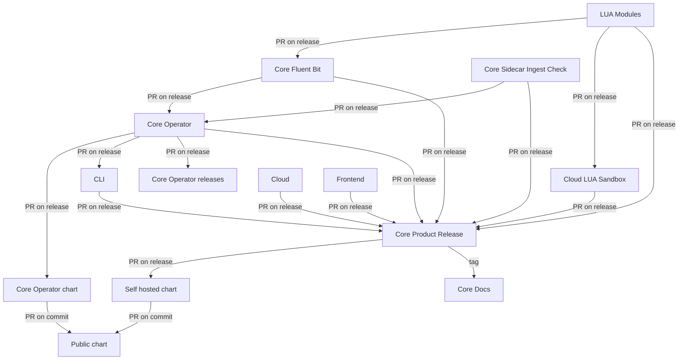

# core-product-release

A public repository handling the integrated release of the various
components making up a Calyptia Core product version.

## Release workflow

The following directed graph demonstrates how and where release versions flow between components.
Each arrow indicates a PR.

All target PRs are created directly on release from the source repository.
The Core Product Release repository drives the self-hosted chart updates via a release from here, i.e. create a tag and then it will create a release that also updates the self-hosted updates.

## Tagging

This repository will be tagged with a specific Core Product overall release made up of the various versions for the individual components.
A tag will then indicate a supported set of components as a particular overall product version.
A tag will also drive Core Docs updates with a changelog and any other relevant details.

