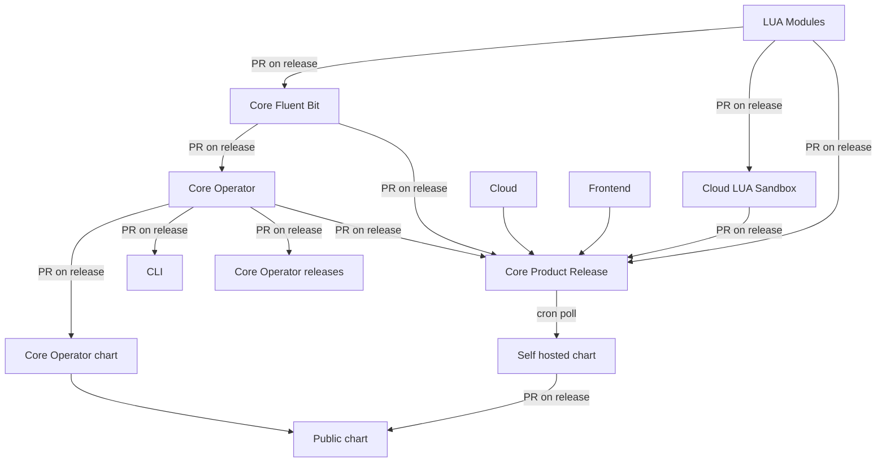

# core-product-release

A public repository handling the integrated release of the various
components making up a Calyptia Core product version.

## Release workflow

The following directed graph demonstrates how and where release versions flow between components.
Each arrow indicates a PR.

The Core Product Release repository drives the self-hosted chart updates via a cron job.
All other PRs are created directly on release from the source repository.
