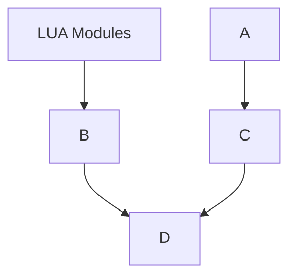

# core-product-release

A public repository handling the integrated release of the various
components making up a Calyptia Core product version.

## Release workflow

The following directed graph demonstrates how and where release versions flow between components.
Each arrow indicates a PR.



```mermaid
graph TD;
   LUA modules-->Core Fluent Bit;
   LUA modules-->Cloud LUA Sandbox;
   LUA modules-->Core Product Release;

   Core Fluent Bit-->Core Operator;
   Core Fluent Bit-->Core Product Release;

   Core Operator-->Core Operator chart;
   Core Operator-->CLI;
   Core Operator-->Core Operator releases;

   Core Operator chart-->Public chart;

   Cloud-->Core Operator releases;
   Frontend-->Core Operator releases;
   Cloud LUA Sandbox-->Core Operator releases;

   Core Product Release-->Self hosted chart;
   Self hosted chart-->Public chart;
```

The Core Product Release repository drives the self-hosted chart updates via a cron job.
All other PRs are created directly on release from the source repository.
